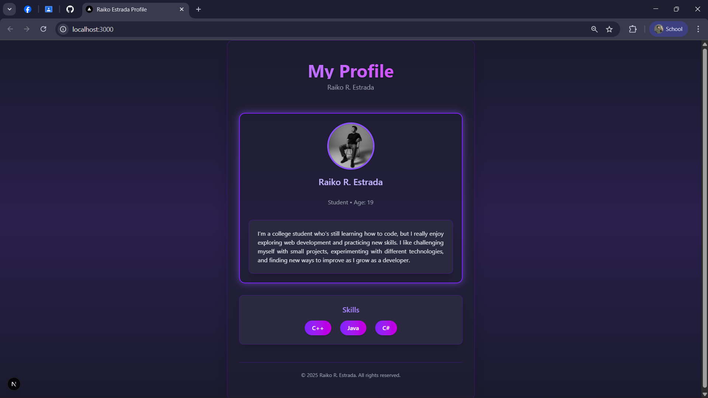

# 🌐 My Profile Page (Next.js Project)

This is a **Profile Page** built with [Next.js](https://nextjs.org) and styled using **Tailwind CSS**.  
It showcases my personal information, skills, and a modern UI with animations, hover effects, and glowing borders.  

---

## 📸 Preview



---

## ⚡ Features

- Built with **Next.js 15**
- Styled using **Tailwind CSS**
- Interactive profile card with:
  - Flip animation for birthday reveal 🎂
  - Hover image swap effect 🖼️
  - Neon glowing border ✨
- Skills list with animated progress bars 💻
- Responsive design for all screen sizes 📱

---

## 🚀 Getting Started

First, run the development server:

```bash
npm run dev
# or
yarn dev
# or
pnpm dev
# or
bun dev
Then open http://localhost:3000 with your browser to see the project.

